# Campus Canteen Live

Order canteen food from your phone, confirm with a 4-digit SMS code, and watch the order go
from kitchen to counter **live**. Every screen (student phone, kitchen phone, admin) shows the
same server state within a second, with no refresh. The menu shows every dish in **3D**.

- **Students:** browse a 3D menu → cart → OTP code → daily token (101, 102, …) → live tracker
  with queue position → "Ready, show token 107" with chime + vibration → bill after pickup.
- **Kitchen (on a phone):** live board with New / Preparing / Ready tabs, one-tap actions, timers,
  Collect-by-token box, stock and open/closed switches.
- **Admin:** live dashboard, menu management (with 3D model picker), users, settings, bills.

Built from `docs/PRD.txt` plus the approved design changes in
`docs/superpowers/specs/2026-09-23-campus-canteen-live-design.md` (illustrated in
`docs/Campus Canteen Live - How It Works.pdf`).

---

## Setup

Requires **Node.js 20.12+** (Windows, macOS or Linux).

```bash
npm install
npm run setup      # creates .env (random JWT_SECRET), the SQLite database, and seed data
npm run dev        # http://localhost:3000
```

That's all. `npm run setup` is safe to run again (the seed upserts).

### Seed accounts

| Role    | Email                  | Password     | Mobile          |
| ------- | ---------------------- | ------------ | --------------- |
| Admin   | `admin@canteen.test`   | `admin123`   |                 |
| Staff   | `kitchen@canteen.test` | `kitchen123` |                 |
| Student | `asha@canteen.test`    | `student123` | +91 90000 00001 |
| Student | `ravi@canteen.test`    | `student123` | +91 90000 00002 |
| Student | `meena@canteen.test`   | `student123` | +91 90000 00003 |

The login page has a **Demo accounts** shortcut that fills these in.

### Order codes (OTP) in development

With `SMS_PROVIDER=console` (the default) no SMS is sent: the code is **printed in the server
terminal**, e.g. `📱 SMS to +919000000001: 4821 is your Campus Canteen order code`.
`OTP_DEV_CODE=1234` is also accepted in development and tests. The server refuses to start in
production if `OTP_DEV_CODE` is set.

---

## LAN demo: laptop + phones on the same Wi-Fi

1. Find the laptop's LAN IP:
   - Windows: `ipconfig` → "IPv4 Address" (e.g. `192.168.1.20`)
   - macOS: `ipconfig getifaddr en0` · Linux: `hostname -I`
2. In `.env` set `NEXT_PUBLIC_APP_URL=http://192.168.1.20:3000` (the server already listens on
   `0.0.0.0`). Restart `npm run dev`.
3. Allow Node.js through the firewall when Windows asks (Private networks).
4. On phones, open `http://192.168.1.20:3000`:
   - **Student phone**: register (or log in as Asha) and order.
   - **Kitchen phone**: log in as `kitchen@canteen.test`, tap **Enable sound**.
   - **Admin** (phone or laptop): `admin@canteen.test` → live dashboard.
5. Optional: `npm run simulate -- --kitchen` fills the board with live traffic.

### Real SMS for free: your own Android phone as the gateway

Codes can be sent from an Android phone's SIM, using
[SMS Gateway for Android](https://github.com/capcom6/android-sms-gateway) (free, open source):

1. Install the app on an Android phone with a SIM, on the same Wi-Fi as the laptop.
2. In the app turn on **Local server**. Note the address (e.g. `http://192.168.1.50:8080`), the
   username and the password it shows.
3. In `.env`:
   ```
   SMS_PROVIDER=android-gateway
   SMS_GATEWAY_URL=http://192.168.1.50:8080
   SMS_GATEWAY_USER=sms
   SMS_GATEWAY_PASSWORD=<from the app>
   ```
4. Restart the server. **Admin → Settings → OTP SMS** shows whether the gateway is online and how
   many codes went out today.

Limits to know: most Indian prepaid plans include **~100 free SMS a day** (so ~100 orders a day,
one code per order), the phone must stay on and online, and codes come from a personal number.
Switching to a paid provider later is one new file in `src/lib/sms/`.

---

## Demo traffic simulator

```bash
npm run simulate -- --url http://localhost:3000 --interval 5 --count 20 --kitchen
```

Logs in as the seeded students and places a random 1-3 item order every ~5 s (±40%), verifying
each with the dev code. A phone may get one code per 30 s and five per hour, so the simulator
registers extra "Demo Student" accounts when needed. With `--kitchen` it also moves each order to
PREPARING (5-15 s), READY (+10-20 s) and COLLECTED (+20 s, creating the bill). It uses only the
public HTTP API.

## Food photos and 3D food

**Photos.** Menu cards, the cart and the dish sheet show real food photos from
**Wikimedia Commons**, used under their Creative Commons licences (mostly CC BY-SA). Each photo's
author and licence is listed on the public **`/credits`** page, linked from the login page and
the bottom of the menu. That credit is what the licence requires, so keep it if you change photos.
The files live in `public/photos/` (800×640 WebP, 20-90 KB) and the credits in
`src/lib/photo-credits.ts`. Images copied from Google search results are usually copyrighted and
were deliberately not used.

**3D.** The dish sheet has a **Photo | 3D** toggle. Every dish is a stylised procedural Three.js
model served on a **steel plate**, a **banana leaf** or with **katoris** (no model files to
download) in `src/components/food3d/`. The live viewer loads only when 3D is chosen (drag to spin,
pinch to zoom, steam on hot food). Without WebGL, or with reduced motion, a rendered still is shown.

After changing a model, regenerate the stills with the dev server running:

```bash
npm run render:stills
```

## Tests

```bash
npm run typecheck
npm run lint
npm test               # Vitest: unit + integration (separate prisma/test.db) + socket rooms
npm run test:e2e       # Playwright, two phones side by side (starts the dev server if needed)
# PW_CHANNEL=chrome npm run test:e2e   to drive your installed Chrome
```

What's covered: the full transition table by role, queue maths, business date across IST
midnight, paise formatting, validators; 10 parallel orders on stock 3 → exactly 3 succeed;
parallel transitions → one wins; idempotency; sequential unique tokens; OTP lock/expiry/single
use; bills copy values and never change; students/staff/admin sockets receive only their rooms'
events; end-to-end order → kitchen → READY → bill within 2 s, with no reloads.

## Where the data lives

Everything is in one SQLite file, `prisma/dev.db` (orders, order items, bills, OTP challenges,
users, menu, settings). Phones only hold the cart and a temporary copy of the screen. Back it up by
copying the file while the server is stopped. `npm run db:reset` **deletes all orders**.
On hosts with ephemeral disks (Render/Railway free tiers) use a persistent disk or switch Prisma's
provider to PostgreSQL.

---

## How the real-time works

```mermaid
flowchart LR
  S[Student phones] -->|HTTP commands| N
  K[Kitchen phones] -->|HTTP commands| N
  A[Admin] -->|HTTP commands| N
  N[Next.js custom server<br/>pages + route handlers] --> DB[(Prisma + SQLite)]
  N --> G[Android SMS gateway]
  N -->|emit after commit| IO[Socket.IO<br/>same port 3000]
  IO -->|user:id| S
  IO -->|kitchen| K
  IO -->|admin + kitchen| A
```



1. **The server is the single source of truth.** Every write is an HTTP request that is validated
   (Zod), authorized (role checks in route handlers) and runs in a Prisma transaction.
2. **Emit only after commit**, only through `src/lib/realtime/emitters.ts`, to the right rooms:
   `public` (menu, open/closed), `user:{id}` (a student's orders and queue position), `kitchen`,
   `admin`. Clients never pick rooms and never write through the socket.
3. **Snapshot + events.** Each screen loads a snapshot over REST (TanStack Query) and patches it
   from socket events. Order events apply only if their `version` is newer, so late or duplicate
   events are harmless.
4. **Recovery.** On every reconnect (including the browser coming back online) all snapshots are
   refetched, so updates missed while offline appear without a refresh. There is no polling.
5. **Concurrency.** Stock uses a conditional decrement (`stock >= qty`), status changes check
   `expectedVersion`, tokens come from a per-day counter inside the transaction, the OTP token is
   consumed inside the same transaction, and `Idempotency-Key` makes double taps create one order.

## Project map

```
server.ts                 Next.js + Socket.IO on one port, graceful shutdown
prisma/                   schema, migration, idempotent seed
scripts/                  simulate-orders, render-stills, ensure-env
src/app/                  pages (student, kitchen, admin) and api/ route handlers
src/lib/orders|otp|sms|bills|menu   services (transactions live here)
src/lib/realtime/         event types, rooms/presence, emitters
src/components/food3d/    procedural 3D dishes, viewer, studio lighting
tests/                    unit, integration (incl. sockets), e2e
```

See `DECISIONS.md` for every choice the PRD left open.
